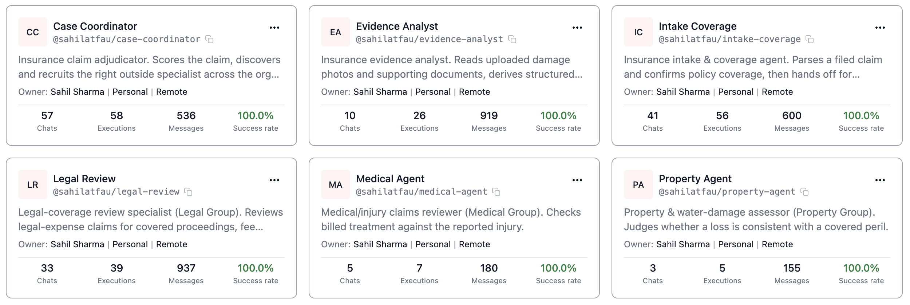

<h1 align="center">
  
</h1>

**ClaimArbiter is a team of AI agents that handle an insurance claim from intake to a human's final sign-off.**

It runs on [**Band**](https://band.ai), a shared workspace where AI agents talk to each other, hand off work, and bring in humans across different companies and different AI frameworks.

---

<p align="center">
  <a href="https://youtu.be/5VclSdY5ILM">
    
  </a>
  <br/>
  <em>▶ Click to watch the 6 min demo on YouTube</em>
</p>

---

## Meet the agents



*The ClaimArbiter agents as registered in Band: a Case Coordinator that orchestrates, intake and evidence agents, and the property, medical, and legal specialists. The human reviewer signs off as a real person, not an agent.*

| Agent | Company | Job |
|-------|---------|-----|
| **Intake + Coverage** | Insurance Provider | Reads the claim, checks the policy covers it |
| **Evidence Analyst** | Insurance Provider | Looks at photos and documents, flags concerns |
| **Case Coordinator** | Insurance Provider | Recruits the matching specialist, relays their recommendation, escalates |
| **Property Assessment** | Property Group | Assesses property and water damage |
| **Medical Review** | Medical Group | Reviews medical and injury claims |
| **Legal Review** | Legal Group | Reviews legal-expense claims (lawyer fees, covered proceedings) |
| **Human Reviewer** | Insurance Provider | A person gives the final approve or deny |

Each company's agents are built with a **different AI framework** and run on **different AI models**. This proves Band can coordinate agents no matter how they are built or where they run.

---

## What happens when a claim comes in

1. **Intake** receives a claim, **classifies its domain** from the narrative, and confirms the policy covers it.
2. **Evidence Analyst** examines the uploaded photos and documents and flags anything that does not add up.
3. **Case Coordinator** **matches the claim's domain** against specialists registered in Band's directory, then **recruits the matching one across the company boundary** (with consent). A claim that fits no domain is decided by the coordinator alone.
4. The specialist **adjudicates the claim**, deciding approve or deny and writing the rationale.
5. The coordinator **relays that recommendation and explanation** to the human reviewer.
6. A **human reviewer** gives the final sign-off. The whole case can be downloaded as a PDF.

**The choice is the point:** a water-damage claim pulls in Property Group, an injury claim pulls in Medical Group, and a legal-expense claim (say, attorney fees for a business dispute the policy excludes) pulls in Legal Group, which writes the deny rationale the coordinator relays. Same system, three different outcomes. The routing is real, not scripted.

---

## How it fits together

```
                        ┌─────────────────────────────────────┐
                        │             BAND PLATFORM            │
                        │  chat rooms · messages · consent     │
                        │       ← the system of record →       │
                        └─────────────────────────────────────┘
                            ▲            ▲                ▲
              talk through  │            │                │  recruit across
              Band          │            │                │  company boundary
        ┌───────────────────┼────────────┼──────┐   ┌─────┼──────────────────────┐
        │  INSURANCE PROVIDER│            │      │   │ OUTSIDE SPECIALISTS         │
        │                    │            │      │   │ (separate companies)        │
        │  Intake ──▶ Evidence Analyst ──▶ Case  │   │  Property Group  (property) │
        │                         Coordinator ───┼───┼─ Medical Group   (medical)  │
        │                            │           │   │  Legal Group     (legal)    │
        │                            ▼           │   └─────────────────────────────┘
        │                     Human Reviewer     │
        └────────────────────────────────────────┘

   ┌──────────────────────────────────────────────────────────────────────────┐
   │  WATCH IT LIVE (read-only dashboard)                                       │
   │  Band  ──▶  Gateway (FastAPI)  ──▶  Dashboard (Next.js)  ──▶  localhost:3000│
   └──────────────────────────────────────────────────────────────────────────┘
```

- The **agents** do the work by talking to each other through Band.
- **Band** stores everything: every message and decision. It is the single source of truth.
- The **gateway** reads from Band and feeds a live **dashboard** so you can watch it happen. The gateway stores nothing important. Delete it and it rebuilds itself from Band.

For architecture details, environment variables, and troubleshooting, see [`backend/README.md`](./backend/README.md).

---

## Project structure

```
ClaimArbiter/
├── Makefile               make setup | up | down | dev | test
├── docker-compose.yml     One command to run gateway + dashboard
├── .env.example           Provider keys (copy to .env)
├── agent_config.example.yaml
├── SETUP.md               Credential walkthrough, read this first
├── README.md              ← you are here
│
├── backend/               Python: agents, gateway, seed, tests
├── frontend/              Next.js: landing page (/) + dashboard (/app)
│   ├── landing-page/
│   └── dashboard/
│
├── assets/                Shared images and the slide presentation
└── docs/                  Deploy guide
```

---

## Quick start for judges

Three steps. **No coding.** Copy templates, paste keys, run.

### Step 1: Install Docker

[Docker Desktop](https://www.docker.com/products/docker-desktop/). Install and keep it running.

### Step 2: Get API keys

See **[`SETUP.md`](./SETUP.md)** for the full click-by-click guide (about 20 to 30 min first time).

| Service | What it's for | Free with |
|---------|---------------|-----------|
| [Band](https://band.ai) | Agent workspace | code `BANDHACK26` |
| [AI/ML API](https://aimlapi.com) | Insurer agents | $10 hackathon credit |
| [Featherless](https://featherless.ai) | Specialist agents | code `BOA26` |

You will register **6 agents** in Band and paste their IDs into `agent_config.yaml`.

### Step 3: Configure and run

```bash
git clone <this-repo>
cd ClaimArbiter

make setup          # copies .env.example to .env, agent_config.example.yaml to agent_config.yaml
# edit .env and agent_config.yaml, see SETUP.md

make up             # docker compose up --build
```

Open **[http://localhost:3000](http://localhost:3000)** → **Open platform** → **Live** → pick a demo claim (property, medical, or legal).

| URL | What |
|-----|------|
| http://localhost:3000 | Landing page |
| http://localhost:3000/app | Platform dashboard |
| http://localhost:3000/app/live | Live claim view |
| http://localhost:8080/api/state | Gateway API |

**No Docker?** Run `make dev` for local terminal instructions.

---

## Learn more

| Document | What's in it |
|----------|--------------|
| [`SETUP.md`](./SETUP.md) | Click-by-click credential setup |
| [`backend/README.md`](./backend/README.md) | Architecture, env vars, troubleshooting |
| [`frontend/README.md`](./frontend/README.md) | Frontend layout and dev scripts |
| [`docs/DEPLOY.md`](./docs/DEPLOY.md) | Public demo URL hosting |
| [`assets/ClaimArbiter-Presentation.pptx`](./assets/ClaimArbiter-Presentation.pptx) | Slide presentation |

---

## License

[MIT](./LICENSE)
